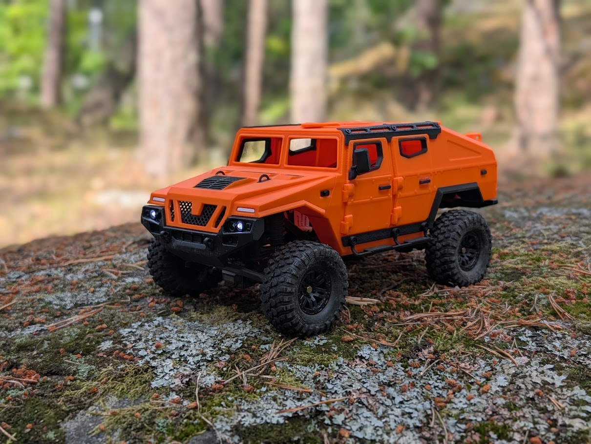
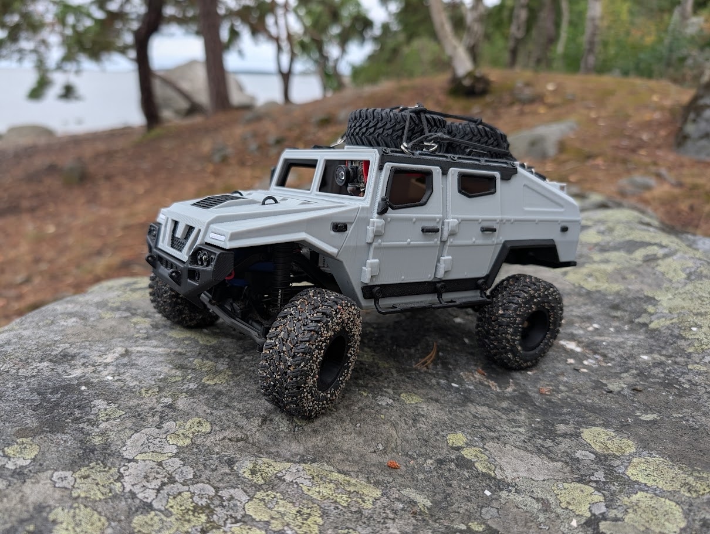

Vehicle Profile

Designation: DV02
Series: Division Vehicle
Platform: Traxxas TRX-4M
Body: Gray Hummer

Status: Active

Driver: Ghost Driver / FPV
Physical Crew: None permanently assigned

---

Role

Exploration, FPV reconnaissance and lightweight expedition vehicle.

DV02 is a compact crawler configured for operations where a small footprint, capable off-road performance and remote observation are useful.

Its defining feature is an integrated FPV system that allows the vehicle to be operated directly from its own perspective.

---

Appearance

Body:
Gray Hummer

Wheels:
Printed

Tires:
INJORA M/T Maverix

Roof Equipment:

- Cargo net
- Capacity for one or two spare wheels

An additional orange body is available as an alternate configuration.

The gray Hummer remains DV02's established primary appearance.

---

Platform

Base Vehicle:
Traxxas TRX-4M

Vehicle Type:
Compact crawler / trail vehicle

DV02 combines a relatively small physical footprint with useful off-road and crawler capability.

This makes it suitable for exploration and observation in locations where larger Division Vehicles would be unnecessary or impractical.

---

FPV System

Status:
Equipped

Camera Location:
Integrated inside the roof

DV02 carries an FPV camera installed inside the roof structure rather than externally on top of the vehicle.

The camera provides a forward view from the vehicle and allows DV02 to be operated from its own perspective rather than relying entirely on direct visual observation from outside.

This capability is a defining part of DV02's operational configuration.

---

Ghost Driver

DV02 is associated with the designation:

Ghost Driver

Unlike many Logistics Division vehicles, DV02 does not currently have a conventional Dummy13 driver permanently assigned.

Instead, the FPV system allows the remote human operator to effectively occupy the driver's position.

From an external perspective, DV02 therefore appears to operate without anyone behind the wheel.

Ghost Driver is not a physical crew member.

It describes the vehicle's unusual operating configuration.

---

Crew

Physical Driver:
None permanently assigned

Operating Configuration:
Ghost Driver / FPV

Human Operator:
Remote

No permanent Dummy13 crew assignment has currently been established.

---

Equipment

Established equipment includes:

- Integrated FPV camera inside roof
- INJORA M/T Maverix tires
- Printed wheels
- Roof cargo capability
- Cargo net
- Capacity for one or two spare wheels

Additional equipment may be added as operational requirements develop.

---

Strengths

- Compact size
- FPV operation
- Remote observation
- Trail capability
- Crawler capability
- Lightweight expedition work
- Ability to operate without visible crew

---

Weaknesses

- Limited cargo capacity compared with larger Division Vehicles
- No permanently assigned physical crew
- Operator occasionally forgets that being inside the vehicle virtually does not make the vehicle larger

---

Standard Procedure

1. Select operating area
2. Verify FPV system
3. Deploy vehicle
4. Conduct exploration or reconnaissance
5. Return vehicle

---

Actual Procedure

1. Activate FPV
2. Become vehicle
3. Explore

---

Operational Role

DV02 is suited to:

- Exploration
- Trail driving
- FPV reconnaissance
- Remote observation
- Lightweight expedition work

No specific permanent route, station or mission assignment has currently been established.

---

Alternate Configuration

Body:
Orange

Status:
Available

An additional orange body exists for the TRX-4M platform.

The orange body is considered an alternate configuration rather than DV02's standard appearance.

Primary Configuration:
Gray Hummer

---

Service Record

Current Status: Active

Primary Role: Exploration / FPV Reconnaissance

Physical Driver: None

Operating Configuration: Ghost Driver

FPV: Equipped

Primary Body: Gray Hummer

Alternate Body: Orange

Tires: INJORA M/T Maverix

---

Notes

DV02 occupies an unusual position within Logistics Division.

It is effectively a crewless vehicle in a fleet where vehicles are commonly associated with physical Dummy13 operators.

Through the integrated FPV system, the human operator becomes the unseen driver.

The vehicle appears occupied from the operator's perspective.

From everyone else's perspective, nobody is driving.

Both observations are technically correct.

---

Final Assessment

DV02 is a compact exploration and reconnaissance platform capable of placing its operator virtually inside the vehicle.

No Dummy13 is permanently behind the wheel.

Someone is still driving.

You just cannot see them.

Ghost Driver.

