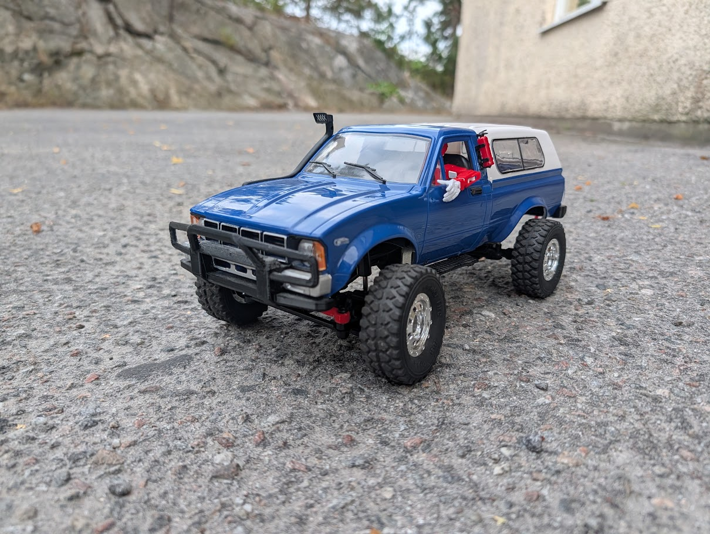

Vehicle Profile

Designation: DV04
Series: Division Vehicle
Platform: WPL C24 Toyota
Body: Toyota Pickup
Color: Blue / White

Status: Active

Driver: Archive
Mechanic: Relic

---

Role

Compact utility, trail and light cargo vehicle.

DV04 is one of the longer-serving operational vehicles within Logistics Division.

Built on the WPL C24 platform, the vehicle has accumulated repairs, modifications and replacement systems throughout its service life rather than being retired when problems developed.

DV04 is not preserved in original condition.

DV04 is kept operational.

---

Appearance

Body:
Toyota Pickup

Color:
Blue / White

Rear Configuration:

- White rear superstructure installed
- Open cargo bed

The white rear superstructure can be removed when an open-bed utility configuration is required.

This gives DV04 a usable cargo area for equipment, supplies and other temporary assignments.

Including turtles.

---

Platform

Base Vehicle:
WPL C24 Toyota

Vehicle Type:
Compact trail / utility vehicle

Drive Configuration:
4×4

DV04 retains much of the mechanical character of the original WPL C24 platform.

Its development has focused primarily on keeping the existing vehicle useful and reliable rather than replacing the platform entirely.

This makes DV04 a continuously maintained legacy vehicle rather than a preserved original.

---

Crew

Archive

Role:
Driver

Assignment Status:
Permanent

Archive is permanently assigned as DV04's driver.

Archive originates from the original unnumbered firmware beta and predates the introduction of formal firmware version numbers.

The pairing is appropriate.

Archive is an old operational unit.

DV04 is an old operational vehicle.

Neither has requested replacement.

---

Relic

Role:
Mechanic and Technician

Assignment Status:
Primary Mechanic

Relic is responsible for maintaining DV04.

Like Archive, Relic originates from the original unnumbered firmware beta.

Relic has remained associated with DV04 through its repairs, modifications and electronic rebuild.

The operational relationship can be summarized:

Archive drives it.

Relic keeps it running.

---

Crew Dynamic

Archive and Relic form DV04's established operational team.

Both units predate numbered firmware.

DV04 itself is an older platform that has required repair and modernization to remain operational.

The arrangement has therefore proven unusually appropriate.

New systems arrive.

Old systems are replaced.

Relic keeps fixing it.

Archive keeps driving it.

DV04 keeps moving.

---

Electronics

Status:
Rebuilt

Radio System:
RadioMaster MT12

DV04 originally operated using its factory electronics.

Persistent reliability and operational problems eventually resulted in a substantial electronic rebuild.

The original electronic systems were removed and replaced.

The original motor remains.

Following the rebuild, DV04 returned to reliable active service using the RadioMaster MT12 control system.

The vehicle therefore retains its existing mechanical platform while operating with substantially revised electronics.

---

Mechanical Configuration

DV04 retains much of its original WPL C24 mechanical configuration.

Unlike vehicles intended around extensive mechanical redesign, DV04's development has primarily followed a simpler philosophy:

Repair what fails.

Replace what needs replacing.

Return vehicle to service.

The result is neither an original WPL C24 nor a completely redesigned vehicle.

It is DV04.

---

Cargo Capability

Rear Configuration:
Convertible enclosed / open bed

With the white rear superstructure removed, DV04 can operate as a compact open-bed utility vehicle.

The bed can carry:

- Small cargo
- Tools
- Field equipment
- Supplies
- Temporary mission payloads
- Turtles

No permanent cargo configuration has been established.

---

Strengths

- Compact size
- Trail capability
- Utility transport
- Open-bed cargo capability
- Proven maintainability
- Established driver / mechanic team
- Refuses to become obsolete

---

Weaknesses

- Significant electronic history
- Limited cargo capacity
- Older platform
- Relic knows exactly which noise is normal

---

Standard Procedure

1. Receive assignment
2. Configure rear body as required
3. Load equipment or cargo
4. Verify vehicle condition
5. Deploy
6. Complete assignment
7. Return to service

---

Actual Procedure

1. Archive starts DV04
2. Determine whether noise is normal
3. Relic confirms noise is normal
4. Continue mission

---

Operational Role

DV04 is suited to:

- General trail operation
- Utility transport
- Light cargo work
- Open-bed transport
- Field support
- General Logistics Division operations

No narrower specialist role has currently been established.

---

Documented Service Event

Event:
Major Electronic Rebuild

Situation:

DV04 experienced persistent reliability and operational problems with its original electronics.

Response:

Problematic electronic systems were removed and replaced.

The original motor was retained.

A RadioMaster MT12 control system was introduced.

Result:

Electronic reliability restored.

Vehicle returned to satisfactory operational condition.

Retirement avoided.

---

Service Record

Current Status: Active

Platform: WPL C24 Toyota

Driver: Archive

Mechanic: Relic

Radio System: RadioMaster MT12

Electronic Status: Rebuilt

Original Motor: Retained

Rear Configuration: Enclosed / Open Bed

Primary Role: Utility / Trail / Light Cargo

Retirement Status: Not requested

---

Known Associates

Archive

Permanent driver.

Predates numbered firmware.

Continues driving DV04.

---

Relic

Primary mechanic.

Predates numbered firmware.

Continues repairing DV04.

---

Notes

DV04's operational history is defined less by remaining original than by remaining useful.

Its electronics have changed.

Its configuration can change.

Its crew has remained.

DV04 is not a pristine asset.

It is an asset that has been repaired, modified and returned to service.

This distinction is considered important.

---

Internal Assessment

Archive describes DV04 as:

No formal assessment recorded.

Relic describes DV04 as:

No formal assessment recorded.

Node describes DV04 as:

«Operational.»

This is considered sufficient.

---

Final Assessment

DV04 is an old truck operated by an old driver and maintained by an old mechanic.

None of the three are obsolete.

All three remain in active service.

Retirement status:

Not requested.

