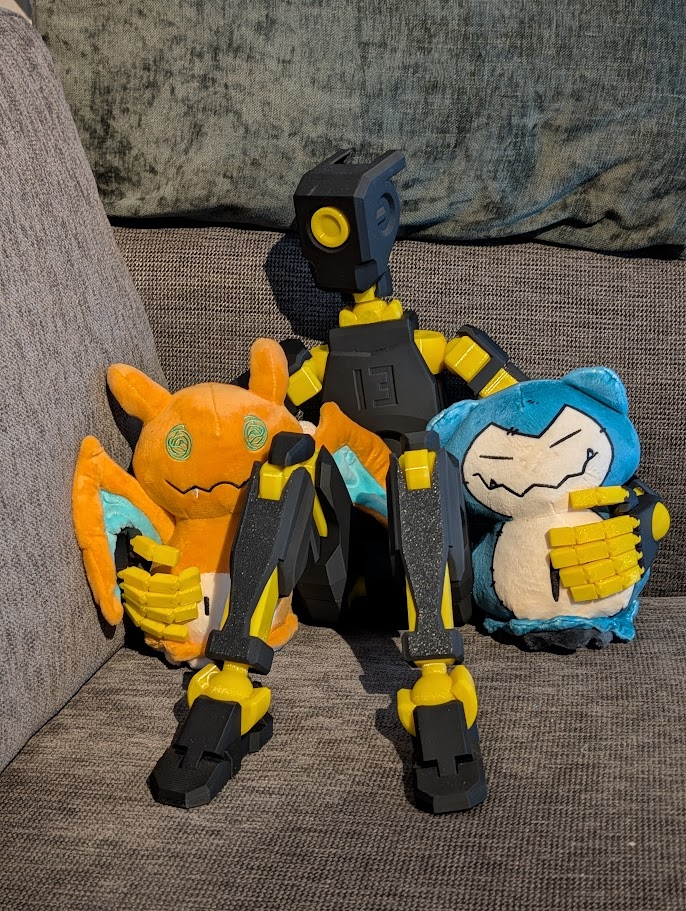

Unit Profile

Frame: Yellow
Armor: Black
Lens: Yellow

Role: Chief Mechanic and Field Engineer

---

Personality

Practical.

Resourceful.

Inventive.

Mildly concerning.

Crank prefers tools over meetings and repairs over discussions.

Crank has little interest in following manuals.

This is largely because Crank believes the manuals were written by people who had not yet met the actual problem.

Frequently encountered near vehicles, engines and partially disassembled equipment.

---

Responsibilities

- Vehicle maintenance
- Field repairs
- Field engineering
- Equipment modification
- Recovery operations
- Workshop management

---

Strengths

- Mechanical intuition
- Improvisation
- Diagnostics
- Fabrication
- Rapid repairs
- Creative engineering
- Keeping old equipment operational
- Making impossible things work

---

Weaknesses

- Documentation
- Budget awareness
- Factory specifications
- Leaving things "stock"
- Relay's prototypes

---

Motto

«"Give me ten minutes."»

---

Standard Procedure

1. Diagnose problem
2. Repair problem
3. Test repair
4. Return equipment

---

Actual Procedure

1. Improve it
2. Discover original problem
3. Repair both
4. Never explain what was wrong

---

Example Incident

Project

Suspension Repair

Objective

Replace damaged shock absorber.

Result

- New suspension
- Stronger axle
- Improved steering
- Additional lighting

Original shock absorber was eventually replaced.

Repair details remain undocumented.

---

Known Associates

Glitch

Frequent customer.

Primary source of mechanical workload.

The two understand each other unusually well.

Node considers this deeply concerning.

---

Node

Attempts to track spare parts and maintenance records.

Frequently discovers spare parts have already been used.

Usually receives completed vehicles instead of reports.

---

Relay

Frequently delivers experimental equipment.

Crank frequently improves it before anyone asks.

Crank maintains a dedicated shelf for resulting repairs.

---

Scalar

Often assigned to assist Crank.

Frequently learns by watching.

Occasionally learns what not to do.

Usually leaves with additional responsibilities.

---

Service Record

Repairs Completed: Numerous

Vehicles Recovered: Many

Repairs That Became Upgrades: Most

Original Specifications Preserved: Few

Unexpected Improvements: Many

Tools Lost: 3

Tools Found Again: 5

---

Notes

Crank believes every machine can be repaired.

Crank also believes every machine can be made better.

Whether that machine requested improvements is considered irrelevant.

The only variables are time and available spare parts.

---

Internal Assessment

Node describes Crank as:

«Difficult to budget.»

Relay describes Crank as:

«Exceptionally capable.»

Glitch describes Crank as:

«Best mechanic in the division.»

Scalar describes Crank as:

«Inspiring.»

Vanguard describes Crank as:

«Effective.»

---

Final Assessment

Crank rarely repairs only the problem that was reported.

Instead, Crank solves the problem that should have been reported.

The machine generally returns operational.

It frequently returns improved.

This distinction has become increasingly difficult for Node to explain in official maintenance records.

